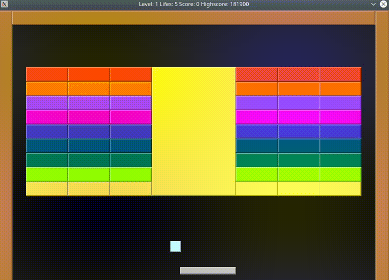

# BRICKS

## Dependencies for Running Locally
* cmake >= 3.7
  * All OSes: [click here for installation instructions](https://cmake.org/install/)
* make >= 4.1 (Linux, Mac), 3.81 (Windows)
  * Linux: make is installed by default on most Linux distros
  * Mac: [install Xcode command line tools to get make](https://developer.apple.com/xcode/features/)
  * Windows: [Click here for installation instructions](http://gnuwin32.sourceforge.net/packages/make.htm)
* SDL2 >= 2.0
  * All installation instructions can be found [here](https://wiki.libsdl.org/Installation)
  * Note that for Linux, an `apt` or `apt-get` installation is preferred to building from source.
* SDL2 Mixer >= 2.0
  * Linux: can be installed with command:
  *`sudo apt install libmikmod-dev libfishsound1-dev libsmpeg-dev liboggz2-dev libflac-dev libfluidsynth-dev libsdl2-mixer-dev libsdl2-mixer-2.0-0 -y;`
  * Windows/Mac: Runtime Binaries can be found [here](https://www.libsdl.org/projects/SDL_mixer/) for Windows and Mac
* gcc/g++ >= 8.0
  * Linux: gcc / g++ is installed by default on most Linux distros
  * Mac: same deal as make - [install Xcode command line tools](https://developer.apple.com/xcode/features/)
  * Windows: recommend using [MinGW](http://www.mingw.org/)

## Basic Build Instructions

1. Clone this repo.
2. Go to folder `bricks`
3. Run `make build`
3. `cd build`
4. `./bricks`

## Running Unit tests

1. Go to folder `bricks`
2. Run `make build`
3. `cd build`
4. `./tests`

## Additional Commands from Makefile

* `make debug` -> build with debug information
* `make format` -> runs clang format on project
* `make clean` -> delete build folder
* `make memcheck` -> builds app and runs it with valgrind

for more information see Makefile in bricks folder