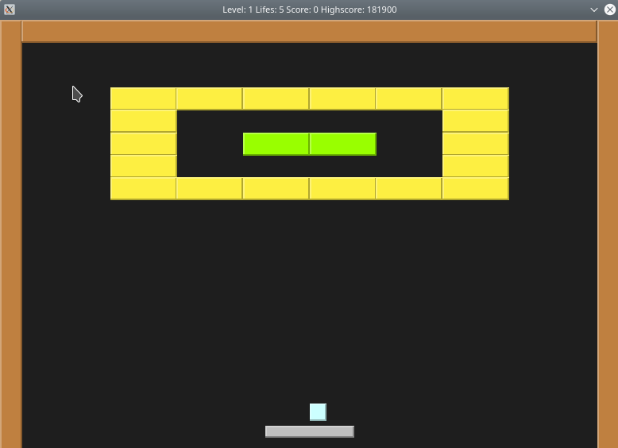
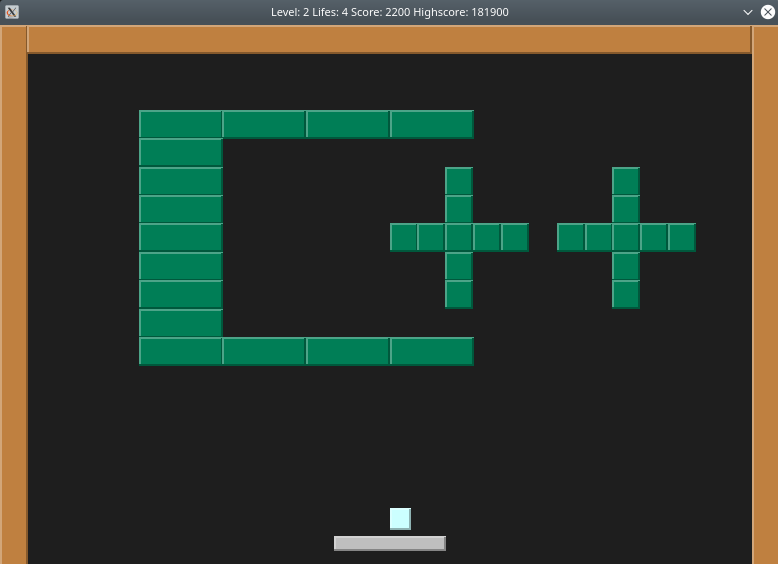
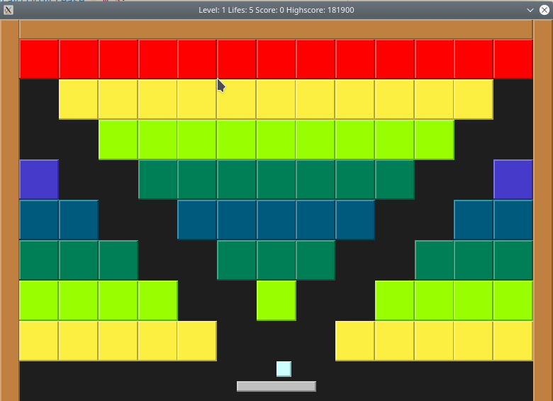
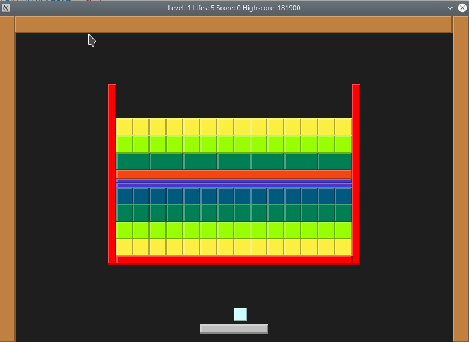

# Bricks


<table>
  <tr>
    <td></td>
    <td></td>
  </tr>
    <tr>
    <td></td>
    <td></td>
  </tr>
 </table>

## Features

* Basic gameplay similar to games like [Breakout](https://en.wikipedia.org/wiki/Arkanoid) or [Arkanoid](https://en.wikipedia.org/wiki/Arkanoid)
* It displays Level, Lifes, Score and Highscore
* Sound
* It contains 5 Levels to play (but more can be added, since they are loaded from the file)
* The difficullty increases on each playthrough
* The "Highscore" is saved on program exit
* It contains a "Pause" function (Press P)


## Dependencies for Running Locally
* cmake >= 3.7
  * All OSes: [click here for installation instructions](https://cmake.org/install/)
* make >= 4.1 (Linux, Mac), 3.81 (Windows)
  * Linux: `make` is installed by default on most Linux distros
  * Mac: [install Xcode command line tools to get make](https://developer.apple.com/xcode/features/)
  * Windows: [Click here for installation instructions](http://gnuwin32.sourceforge.net/packages/make.htm)
* SDL2 >= 2.0
  * All installation instructions can be found [here](https://wiki.libsdl.org/Installation)
  * Note that for Linux, an `apt` or `apt-get` installation is preferred to building from source.
* SDL2 Mixer >= 2.0
  * Linux: can be installed with command:
  `sudo apt install libmikmod-dev libfishsound1-dev libsmpeg-dev liboggz2-dev libflac-dev libfluidsynth-dev libsdl2-mixer-dev libsdl2-mixer-2.0-0 -y;`
  * Windows/Mac: Runtime Binaries can be found [here](https://www.libsdl.org/projects/SDL_mixer/) for Windows and Mac
* gcc/g++ >= 8.0
  * Linux: `gcc` / `g++` is installed by default on most Linux distros
  * Mac: same deal as `make` - [install Xcode command line tools](https://developer.apple.com/xcode/features/)
  * Windows: recommend using [MinGW](http://www.mingw.org/)

## Cloning 

When cloning this project, be sure to use the --recurse-submodules flag. 

`git clone https://github.com/SandroWissmann/Bricks.git --recurse-submodules`

This makes sure you also clone the submodule for `googletest` which is needed to run the tests

### Running the game

1. Go to folder `bricks`
2. Run `make build`
3. `cd build`
4. `./bricks`

### Running the tests

1. Go to folder `bricks`
2. Run `make build`
3. `cd build`
4. `./tests`

## Additional Commands from Makefile

* `make debug` -> builds with debug information
* `make format` -> runs clang format on project
* `make clean` -> deletes build folder
* `make memcheck` -> builds app and runs it with valgrind

for more information see Makefile in bricks folder

## How to add your own Levels:

1. Go to folder `level`
2. Add a new file with the ending `.lvl`

* Levels get loaded in sorted order

### Format of file

* Example from first level:

```
W 26 H 18
# Format Brick: 
# PointX PointY Length Width HP
#
# Format Indestructible Brick:
# PointX PointY Length Width
# 
X 4.0 Y 2.0 W 3.0 H 1.0 HP 1
X 7.0 Y 2.0 W 3.0 H 1.0 HP 1
X 10.0 Y 2.0 W 3.0 H 1.0 HP 1
X 13.0 Y 2.0 W 3.0 H 1.0 HP 1
X 16.0 Y 2.0 W 3.0 H 1.0 HP 1
X 19.0 Y 2.0 W 3.0 H 1.0 HP 1
//...
```

#### First line:

`W 26 H 18`

It defines the size of the board. All sizes from all levels should be the same.
If you want different sizes, you have to change it in all the `.lvl` files.


#### Lines starting with a `#`:

`# PointX PointY Length Width`

Soley used as a comment. You can use this feature to group the bricks you add.


#### Bricks:

`X 4.0 Y 2.0 W 3.0 H 1.0 HP 1`

X = X Position on the grid 
Y = Y Position on the grid
W = Width of the block
H = Height of the block
HP = Hitpoints of the brick. Must be in range 1 to 9.

#### Indestructible Bricks:

`X 4.0 Y 2.0 W 3.0 H 1.0`

Same as Bricks. The only difference is the missing `HP` specification.